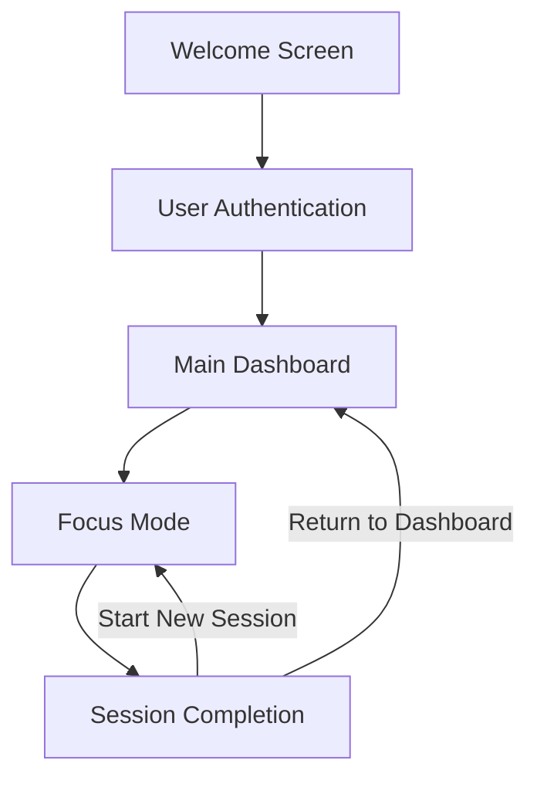

# DeepWork AI: Productivity App Documentation

## Overview

DeepWork AI is a productivity application designed to help users manage tasks efficiently and maintain focus during work sessions. The app leverages artificial intelligence to prioritize tasks and provide personalized productivity insights.

## Core Workflow


## Tech Stack:
- Frontend: React Native with TypeScript, Expo, and Expo Router
- Backend/Database: Supabase
- UI Framework: React Native Paper
- AI Processing: DeepSeek

### 1. Welcome & Onboarding

- **Welcome Screen**: Clean, minimalist interface introducing the app's value proposition
- **Authentication Options**:
  - Sign Up (new users)
  - Log In (returning users)
- **Account Creation**: Email-based registration with secure password creation

### 2. Dashboard Experience

- **Task Overview**: AI-prioritized task list displayed prominently
- **Interaction Methods**:
  - Quick-Add button for rapid task entry
  - AI Chat interface for conversational task management
  - Edit/delete functionality for task refinement
- **Visual Priority Indicators**: Color-coding or icons showing task importance

### 3. Focus Sessions

- **Session Initiation**: User selects a task to enter Focus Mode
- **Focus Environment**:
  - Notification blocking
  - Distraction-free interface
  - Customizable timer (default: Pomodoro technique)
  - Pause/resume functionality
- **Session Controls**: Options to complete early or extend time as needed

### 4. Progress & Analytics

- **Session Summary**: Performance metrics displayed after each focus period
- **Productivity Insights**: AI-generated recommendations based on work patterns
- **Progress Visualization**: Charts and graphs showing productivity trends

## Key Features

### AI-Powered Task Management

| Feature | Description |
|---------|-------------|
| Smart Prioritization | Tasks automatically ranked by urgency and importance |
| Natural Language Processing | Conversational interface for task creation and management |
| Adaptive Learning | System improves recommendations based on user behavior |

### Focus Enhancement Tools

- **Distraction Blocking**: Prevents interruptions during focus sessions
- **Timer Customization**: Flexible work intervals based on user preference
- **Environment Controls**: Optional ambient sounds or white noise

### Progress Tracking System

- **Session Metrics**: Duration, completion rate, and focus quality
- **Productivity Patterns**: Identification of optimal work times and conditions
- **Achievement System**: Rewards and milestones for consistent usage

## Technical Requirements

- **Frontend**: Responsive design supporting multiple device types
- **Backend**: Secure user authentication and data storage
- **AI Integration**: Machine learning models for task prioritization
- **Notifications**: Configurable alert system for session reminders

## Database Schema

The DeepWork AI application uses Supabase as its backend database solution. Below is the complete database schema:

### Tables

#### 1. users
| Column | Type | Description |
|--------|------|-------------|
| id | uuid | Primary key, auto-generated |
| email | varchar | User's email address (unique) |
| created_at | timestamp | Account creation timestamp |
| updated_at | timestamp | Last account update timestamp |
| full_name | varchar | User's full name |
| avatar_url | varchar | URL to user's profile image |
| preferences | jsonb | User preferences (theme, notifications, etc.) |
| time_zone | varchar | User's time zone |
| last_login | timestamp | Last login timestamp |

#### 2. tasks
| Column | Type | Description |
|--------|------|-------------|
| id | uuid | Primary key, auto-generated |
| user_id | uuid | Foreign key to users.id |
| title | varchar | Task title |
| description | text | Detailed task description |
| created_at | timestamp | Task creation timestamp |
| updated_at | timestamp | Last task update timestamp |
| due_date | timestamp | Task due date and time |
| priority | integer | Priority level (1-5) |
| status | varchar | Task status (todo, in_progress, completed) |
| tags | varchar[] | Array of tags associated with the task |
| ai_priority_score | float | AI-calculated priority score |
| estimated_duration | integer | Estimated duration in minutes |
| parent_task_id | uuid | Foreign key to tasks.id for subtasks |

#### 3. focus_sessions
| Column | Type | Description |
|--------|------|-------------|
| id | uuid | Primary key, auto-generated |
| user_id | uuid | Foreign key to users.id |
| task_id | uuid | Foreign key to tasks.id |
| started_at | timestamp | Session start timestamp |
| ended_at | timestamp | Session end timestamp |
| duration | integer | Session duration in minutes |
| completed | boolean | Whether session was completed |
| focus_score | float | AI-calculated focus quality score |
| notes | text | User notes about the session |
| interruptions | integer | Number of interruptions during session |

#### 4. productivity_insights
| Column | Type | Description |
|--------|------|-------------|
| id | uuid | Primary key, auto-generated |
| user_id | uuid | Foreign key to users.id |
| created_at | timestamp | Insight creation timestamp |
| insight_type | varchar | Type of insight (pattern, recommendation, etc.) |
| content | text | Insight content |
| data_points | jsonb | Data used to generate the insight |
| dismissed | boolean | Whether user has dismissed the insight |

#### 5. achievements
| Column | Type | Description |
|--------|------|-------------|
| id | uuid | Primary key, auto-generated |
| user_id | uuid | Foreign key to users.id |
| achievement_type | varchar | Type of achievement |
| unlocked_at | timestamp | When achievement was unlocked |
| progress | float | Progress towards achievement (0-1) |
| metadata | jsonb | Additional achievement data |

#### 6. tags
| Column | Type | Description |
|--------|------|-------------|
| id | uuid | Primary key, auto-generated |
| user_id | uuid | Foreign key to users.id |
| name | varchar | Tag name |
| color | varchar | Tag color (hex code) |
| created_at | timestamp | Tag creation timestamp |

#### 7. notifications
| Column | Type | Description |
|--------|------|-------------|
| id | uuid | Primary key, auto-generated |
| user_id | uuid | Foreign key to users.id |
| created_at | timestamp | Notification creation timestamp |
| read_at | timestamp | When notification was read |
| type | varchar | Notification type |
| content | text | Notification content |
| action_url | varchar | URL for notification action |

### Relationships
- users 1:N tasks (one user has many tasks)
- users 1:N focus_sessions (one user has many focus sessions)
- users 1:N productivity_insights (one user has many insights)
- users 1:N achievements (one user has many achievements)
- users 1:N tags (one user has many tags)
- users 1:N notifications (one user has many notifications)
- tasks 1:N focus_sessions (one task has many focus sessions)
- tasks 1:N tasks (parent task has many subtasks)

### Indexes
- users(email) - For fast login lookups
- tasks(user_id, status) - For filtering tasks by status
- tasks(user_id, due_date) - For date-based task queries
- focus_sessions(user_id, started_at) - For time-based session queries
- tasks(ai_priority_score) - For priority-based sorting

## Application Folder Structure

The DeepWork AI application follows a modular, feature-based folder structure optimized for React Native with Expo and TypeScript:

```
/DeepworkAI
├── app/                      # Expo Router app directory
│   ├── (auth)/               # Authentication routes
│   │   ├── login.tsx
│   │   ├── register.tsx
│   │   └── forgot-password.tsx
│   ├── (main)/               # Main app routes
│   │   ├── index.tsx         # Dashboard screen
│   │   ├── tasks/            # Task-related screens
│   │   │   ├── index.tsx     # Task list
│   │   │   ├── [id].tsx      # Task details
│   │   │   └── create.tsx    # Create task
│   │   ├── focus/            # Focus mode screens
│   │   │   ├── index.tsx     # Focus session setup
│   │   │   ├── session.tsx   # Active focus session
│   │   │   └── summary.tsx   # Session summary
│   │   ├── insights/         # Insights and analytics
│   │   │   ├── index.tsx     # Insights dashboard
│   │   │   └── [type].tsx    # Specific insight type
│   │   ├── settings/         # App settings
│   │   │   ├── index.tsx     # Settings menu
│   │   │   ├── profile.tsx   # Profile settings
│   │   │   └── preferences.tsx # App preferences
│   │   └── _layout.tsx       # Main layout with navigation
│   ├── _layout.tsx           # Root layout
│   └── index.tsx             # Entry point (redirects to auth or main)
├── assets/                   # Static assets
│   ├── fonts/
│   ├── images/
│   └── sounds/               # Focus session sounds
├── components/               # Reusable components
│   ├── common/               # Generic UI components
│   │   ├── Button.tsx
│   │   ├── Card.tsx
│   │   ├── Input.tsx
│   │   └── ...
│   ├── tasks/                # Task-related components
│   │   ├── TaskCard.tsx
│   │   ├── TaskForm.tsx
│   │   └── ...
│   ├── focus/                # Focus session components
│   │   ├── Timer.tsx
│   │   ├── FocusControls.tsx
│   │   └── ...
│   └── insights/             # Analytics components
│       ├── Chart.tsx
│       ├── MetricCard.tsx
│       └── ...
├── constants/                # App constants
│   ├── Colors.ts
│   ├── Layout.ts
│   └── Config.ts
├── hooks/                    # Custom React hooks
│   ├── useAuth.ts
│   ├── useTasks.ts
│   ├── useFocus.ts
│   └── ...
├── services/                 # API and service integrations
│   ├── supabase/             # Supabase client and queries
│   │   ├── client.ts
│   │   ├── auth.ts
│   │   ├── tasks.ts
│   │   └── ...
│   ├── ai/                   # AI service integration
│   │   ├── client.ts
│   │   ├── prioritization.ts
│   │   └── insights.ts
│   └── notifications/        # Notification services
│       ├── push.ts
│       └── local.ts
├── store/                    # State management
│   ├── auth/
│   ├── tasks/
│   ├── focus/
│   └── ...
├── types/                    # TypeScript type definitions
│   ├── supabase.ts           # Database types
│   ├── navigation.ts         # Navigation types
│   └── ...
├── utils/                    # Utility functions
│   ├── date.ts
│   ├── formatting.ts
│   ├── validation.ts
│   └── ...
├── .gitignore
├── app.json                  # Expo configuration
├── babel.config.js
├── eas.json                  # EAS Build configuration
├── package.json
├── tsconfig.json
└── README.md
```

## Future Roadmap

### Phase 1 Enhancements
- Customizable focus durations
- Advanced task categorization and labeling
- Basic productivity analytics

### Phase 2 Expansion
- Team collaboration features
- Calendar integration
- Advanced reporting and insights

### Phase 3 Innovation
- Voice command support
- Wearable device integration
- Personalized coaching features

## User Experience Principles

1. **Simplicity**: Intuitive interface requiring minimal learning
2. **Efficiency**: Quick access to core functions with minimal clicks
3. **Focus**: Design that eliminates distractions and cognitive load
4. **Adaptability**: Personalized experience based on individual work styles

---

*This document serves as a foundation for developers to build a seamless, user-friendly productivity application that optimizes focus and task management.*
